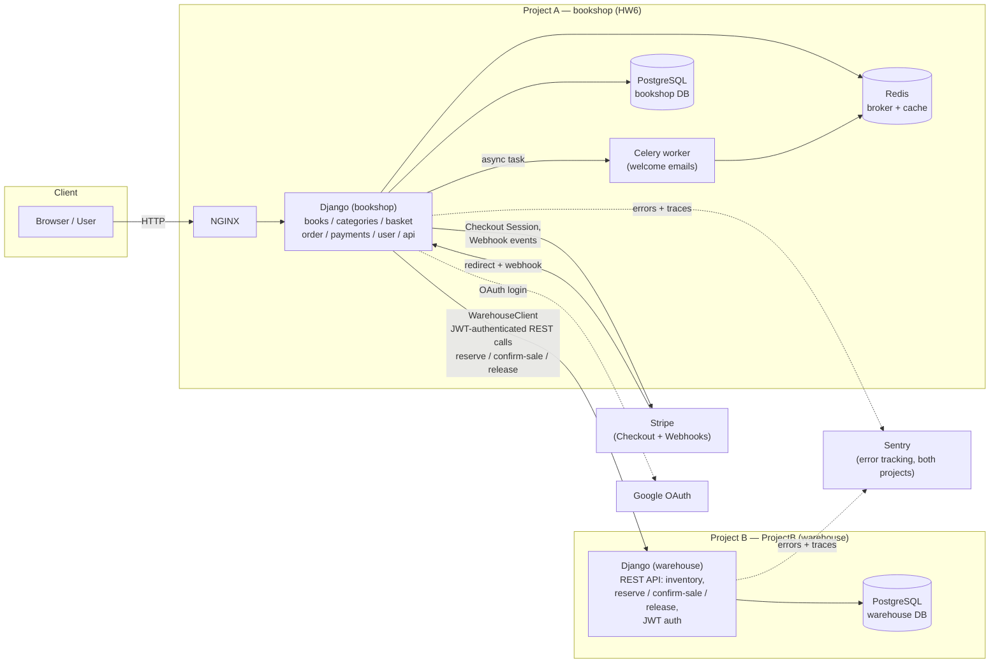

# 📚 BookShop — Multi-Service Capstone

A two-project system:

- **Project A — `HW6/bookshop`**: the Django bookstore application (catalog, cart, orders, Stripe payments, auth, i18n). This is the customer-facing shop.
- **Project B — `ProjectB`**: a separate Django service ("the warehouse") that owns real inventory — reservations, stock confirmation, and stock release — accessed by Project A over a JWT-authenticated REST API.

Educational capstone project (Django 6.0.4).


---

## Table of Contents

- [Architecture](#architecture)
- [Features](#features)
- [Tech Stack](#tech-stack)
- [Project Structure](#project-structure)
- [Getting Started](#getting-started)
  - [Option A: Docker (recommended, runs both projects)](#option-a-docker-recommended-runs-both-projects)
  - [Option B: Local (without Docker)](#option-b-local-without-docker)
- [Environment Variables](#environment-variables)
- [API Documentation (Swagger / OpenAPI)](#api-documentation-swagger--openapi)
- [What Changed in Project A to Connect to Project B](#what-changed-in-project-a-to-connect-to-project-b)
- [The Shopping Cart](#the-shopping-cart)
- [Authentication](#authentication)
- [Permissions](#permissions)
- [Internationalization](#internationalization)
- [Payments (Stripe) + Warehouse Flow](#payments-stripe--warehouse-flow)
- [Async Views](#async-views)
- [Testing](#testing)
- [Logging](#logging)
- [Profiling](#profiling)
- [Known Limitations / Roadmap](#known-limitations--roadmap)
- [Changelog](#changelog)

---

## Architecture



**Request flow for a purchase (happy path):**

1. User adds books to the session cart in Project A (`basket`).
2. On submit, Project A calls Project B (`WarehouseClient`) to **reserve** stock for each item, then creates the local `Order`/`OrderItem` records.
3. User pays via Stripe Checkout.
4. On successful payment, `PaymentSuccessView` calls Project B to **confirm the sale** (final stock deduction on the warehouse side) and marks the local `Order` as `paid`.
5. If the user cancels payment instead, `PaymentCancelView` calls Project B to **release the reservation** and restores local `Book.stock`.

> ⚠️ Step 2 (reservation at cart-submit time) is inferred from `order/tests.py`'s autouse fixture, which mocks `WarehouseClient.reserve_book`. The current `basket/views.py` wasn't available when this README was generated — confirm the exact call site there and update this section if it differs.

---

## Features

- 📖 **Book catalog** — search by title, filter by category, pagination, book detail pages
- 🗂️ **Categories** — CRUD for categories with permission-gated actions
- 🛒 **Shopping cart** — session-based cart, self-cleaning if a cart item's book is later deleted
- 📦 **Orders** — order history and detail pages, tied to authenticated users only
- 🏭 **Warehouse integration (new)** — real inventory managed by a separate service (Project B); reserve → confirm/release lifecycle instead of Project A owning stock unilaterally
- 💳 **Payments** — Stripe Checkout integration (session creation, webhook handling, success/cancel pages, order status updates, email receipts)
- 🔐 **Authentication** — username/password **and** Google OAuth via `django-allauth`
- 🌍 **i18n** — Ukrainian (default) and English
- 📊 **Profiling** — `django-silk`
- 🩺 **Error tracking** — Sentry, wired into both Project A and Project B
- ⏱️ **Background jobs** — Celery + Redis (welcome emails, scheduled tasks via `django-celery-beat`)
- 🧪 **Tests** — `pytest` + `pytest-django`, with the warehouse client mocked at the boundary
- 📑 **REST API** — Django REST Framework + `drf-spectacular` (OpenAPI schema / Swagger UI)

## Tech Stack

| Layer | Technology |
|---|---|
| Backend (both projects) | Django 6.0.4 |
| Database | PostgreSQL (one instance per project) |
| Inter-service auth | JWT (`rest_framework_simplejwt`), obtained by Project A from Project B's token endpoint |
| Payments | Stripe (Checkout Sessions + Webhooks) |
| Auth (end users) | `django-allauth` (Google OAuth) + Django's built-in auth |
| Background tasks | Celery + Redis, `django-celery-beat` for scheduling |
| Caching | Redis (`django-redis`) |
| Error tracking | Sentry (`sentry-sdk`) |
| API layer | Django REST Framework, `django-filter`, `drf-spectacular`, CORS via `django-cors-headers` |
| Profiling | `django-silk` |
| Testing | `pytest`, `pytest-django`, `pytest-asyncio`, `factory_boy` |
| i18n | Django's built-in `gettext` / `LocaleMiddleware` |
| Containerization | Docker + Docker Compose |
| Reverse proxy | NGINX |
| Frontend | Django templates + Bootstrap 5 (via CDN) |

## Project Structure

```
.
├── .github/workflows/main.yml   # CI/CD: lints + tests BOTH Project A and Project B
├── HW6/
│   └── bookshop/                 # Project A — the shop
│       ├── bookshop/              # Project config: settings/, urls, wsgi/asgi, celery.py,
│       │                          # factories.py, services.py (WarehouseClient — NEW)
│       ├── books/                  # Book catalog
│       ├── categories/              # Category CRUD
│       ├── basket/                    # Session cart
│       ├── order/                      # Order & OrderItem models, order history
│       ├── payments/                    # Stripe checkout, webhooks, warehouse confirm/release calls
│       ├── user/                          # Custom user model, auth, Google adapter
│       ├── api/                            # DRF app: books / categories / order / basket subpackages
│       ├── templates/                       # Shared base template
│       ├── locale/                           # .po/.mo translation files
│       ├── logs/                              # orders.log, users.log
│       ├── Dockerfile, docker-compose.yml, docker-entrypoint.sh
│       ├── AI_REVIEW.md, AI_PROMPTS.md
│       └── pytest.ini
└── ProjectB/                     # Project B — the warehouse service (separate Django project)
    ├── (inventory app: reserve / confirm-sale / release endpoints, JWT token issuance)
    └── requirements.txt
```

## Getting Started

### Option A: Docker (recommended, runs both projects)

**Requirements:** Docker, Docker Compose.

1. Create `HW6/bookshop/.env` and `ProjectB/.env` (see [Environment Variables](#environment-variables)).
2. From the repo root, start both projects (adjust if you use separate compose files per project — merge into one `docker-compose.yml` at the repo root, or run each project's compose file with a shared external network so Project A can reach Project B by service name):
   ```bash
   docker-compose up --build
   ```
3. NGINX serves Project A at:
   ```
   http://localhost:8000/
   ```
   Project B is reachable **internally** at `http://project_b:8001` (the default for `WAREHOUSE_SERVICE_URL`) — it does not need to be exposed to the host unless you want to hit it directly for debugging.
4. Create a superuser for Project A:
   ```bash
   docker-compose exec web python manage.py createsuperuser
   ```
5. If Project B also needs seed data / a service account matching `WAREHOUSE_SERVICE_USER` / `WAREHOUSE_SERVICE_PASS`, create it there too (see Project B's own setup docs).

> ⚠️ Both projects must be on the same Docker network for the `project_b` hostname to resolve from inside Project A's container. If they're started from separate `docker-compose.yml` files, either combine them or declare a shared `external` network in both.

### Option B: Local (without Docker)

**Requirements:** Python 3.12+, PostgreSQL, Redis, running locally; Project B running (or reachable) separately.

**Project A:**
```bash
cd HW6/bookshop
python -m venv venv
source venv/bin/activate   # Windows: venv\Scripts\activate
pip install -r requirements.txt
# create .env — see Environment Variables — set DB_HOST=localhost, REDIS_HOST=localhost,
# and WAREHOUSE_SERVICE_URL to wherever Project B is running (e.g. http://localhost:8001)
python manage.py migrate
python manage.py createsuperuser
python manage.py compilemessages
python manage.py runserver
```

**Celery worker (separate terminal, Project A):**
```bash
celery -A bookshop worker -l info
```

**Project B:** follow its own local setup (separate `requirements.txt`, own `manage.py`, own PostgreSQL database). It must be running and reachable at whatever URL you set `WAREHOUSE_SERVICE_URL` to, or every checkout/payment-confirmation call from Project A will fail with the "Не вдалося авторизуватися на складі" auth error.

## Environment Variables

### Project A (`HW6/bookshop/.env`)

```env
# Django
SECRET_KEY=your-secret-key-here

# PostgreSQL (Project A's own DB)
POSTGRES_DB=bookshop
POSTGRES_USER=bookshop_user
POSTGRES_PASSWORD=your-db-password
DB_HOST=localhost           # `db` inside docker-compose network
POSTGRES_PORT=5432

# Redis (cache + Celery broker/result backend)
REDIS_HOST=localhost        # `redis` inside docker-compose network
REDIS_PORT=6379

# Stripe
STRIPE_CLIENT_API=sk_test_your_stripe_secret_key

# Email (order receipts)
EMAIL_HOST_USER=your-email@gmail.com
EMAIL_HOST_PASSWORD=your-app-password

# Google OAuth
GOOGLE_CLIENT_ID=your-google-client-id
GOOGLE_CLIENT_SECRET=your-google-client-secret

# --- Warehouse service (Project B) — NEW ---
WAREHOUSE_SERVICE_URL=http://project_b:8001   # defaults to this in docker-compose
WAREHOUSE_SERVICE_USER=shop_service
WAREHOUSE_SERVICE_PASS=set-this-explicitly     # ⚠️ no default — see note below
```

> 🔴 **Known issue:** `WAREHOUSE_SERVICE_PASS` has **no default value** in `settings/base.py` (unlike `WAREHOUSE_SERVICE_URL` and `WAREHOUSE_SERVICE_USER`, which both fall back to sane defaults). If it isn't set in the environment, `WarehouseClient._get_auth_headers()` posts a `None` password to Project B's token endpoint and every reservation/confirm/release call fails with `Не вдалося авторизуватися на складі` — this is visible repeatedly in `logs/orders.log`. **Set this variable explicitly in every environment**, including CI if you ever stop mocking `WarehouseClient` there.

### Project B (`ProjectB/.env`)

Refer to Project B's own environment variable requirements (its database credentials, and whatever it uses to validate `WAREHOUSE_SERVICE_USER` / `WAREHOUSE_SERVICE_PASS` for issuing JWTs). Not documented here since Project B's settings file wasn't available when this README was written.

> ⚠️ **Security note (carried over from Project A):** `settings/base.py` currently has `EMAIL_HOST_USER` / `EMAIL_HOST_PASSWORD` **hardcoded** in source, and the Sentry DSN is also hardcoded. Move both to environment variables and rotate the email app password before any non-local deployment — these are currently committed to source control.

---

## API Documentation (Swagger / OpenAPI)

Project A ships `rest_framework`, `drf_spectacular`, and `rest_framework_simplejwt`, with `DEFAULT_SCHEMA_CLASS` set to `drf_spectacular.openapi.AutoSchema` in `REST_FRAMEWORK` settings, and JWT as the default authentication class.

Assuming the standard `drf-spectacular` routing convention is wired into `api/urls.py` (confirm against the actual file — it wasn't available when writing this):

| Purpose | URL |
|---|---|
| Raw OpenAPI 3 schema (YAML/JSON) | `/api/schema/` |
| Swagger UI | `/api/schema/swagger-ui/` |
| ReDoc | `/api/schema/redoc/` |

**Auth for trying endpoints in Swagger UI:** obtain a JWT pair via SimpleJWT's token endpoints (typically `/api/token/` and `/api/token/refresh/`, again pending confirmation against `api/urls.py`), then use the "Authorize" button in Swagger UI with `Bearer <access_token>`.

**API structure** (per project memory / `api/` app layout):
- `api/books/` — book listing, detail, create/update/delete (permission-gated)
- `api/categories/` — category CRUD
- `api/order/` — order history, order detail
- `api/basket/` — cart operations (still session-based, no DB model)

Pagination (`PageNumberPagination`, 20/page), search + ordering filters, and throttling (`100/day` anon, `1000/day` authenticated) are enabled globally via `REST_FRAMEWORK` settings in `settings/base.py`.

> 📝 **TODO:** paste `api/urls.py` and the `api/*/urls.py` subpackages so this section can list exact, verified paths instead of the drf-spectacular defaults assumed above.

---

## What Changed in Project A to Connect to Project B

Everything below is verified against the actual files shared in this project — nothing here is speculative.

### 1. New file: `bookshop/services.py`

A new `WarehouseClient` class was added, encapsulating all HTTP calls to Project B:

- `_get_auth_headers()` — obtains and caches a JWT by POSTing `WAREHOUSE_SERVICE_USER` / `WAREHOUSE_SERVICE_PASS` to `{WAREHOUSE_SERVICE_URL}/api/user/token/`; raises `WarehouseServiceError` (a DRF `APIException`, HTTP 502) on failure.
- `_make_request()` — generic request helper with a single retry-on-401 (re-authenticates once if the cached token expired), and timeout/error handling that raises `WarehouseServiceError` or `APIException`.
- `reserve_book(book_id, amount, order_id)` → `POST /api/inventory/items/{book_id}/reserve/`
- `confirm_sale(book_id, amount, order_id)` → `POST /api/inventory/items/{book_id}/confirm-sale/`
- `release_reservation(book_id, amount, order_id)` → `POST /api/inventory/items/{book_id}/release/`

### 2. New settings in `bookshop/settings/base.py`

```python
WAREHOUSE_SERVICE_URL = os.getenv("WAREHOUSE_SERVICE_URL", "http://project_b:8001")
WAREHOUSE_SERVICE_USER = os.getenv("WAREHOUSE_SERVICE_USER", "shop_service")
WAREHOUSE_SERVICE_PASS = os.getenv("WAREHOUSE_SERVICE_PASS")
```
Plus, in the same file, unrelated-but-adjacent additions supporting the broader capstone: `REDIS_HOST`/`REDIS_PORT`, `CACHES`, `CELERY_BROKER_URL`/`CELERY_RESULT_BACKEND`, `CELERY_BEAT_SCHEDULE`, `CORS_*` settings, and `sentry_sdk.init(...)`.

### 3. `payments/views.py` now calls the warehouse at the two points that finalize or reverse a sale

- **`PaymentSuccessView.get()`** — when Stripe confirms payment and the order isn't already `paid`, it now wraps the following in `transaction.atomic()`:
  ```python
  warehouse = WarehouseClient()
  for item in order.items.select_related("book").all():
      warehouse.confirm_sale(book_id=item.book.id, amount=item.quantity, order_id=order.id)
  order.status = "paid"
  order.save()
  ```
  `WarehouseServiceError` is caught and logged separately from generic exceptions, so a warehouse outage after a successful Stripe payment is distinguishable in logs from a Stripe/processing error.

- **`PaymentCancelView.get()`** — when a payment is cancelled and the order isn't already `paid`/`cancelled`, it now releases the reservation and restores local stock, also inside `transaction.atomic()`:
  ```python
  warehouse = WarehouseClient()
  for item in order.items.select_related("book").all():
      warehouse.release_reservation(book_id=item.book.id, amount=item.quantity, order_id=order.id)
      book = item.book
      book.stock += item.quantity
      book.save(update_fields=["stock"])
  order.status = "cancelled"
  order.save()
  ```
  Note this restores `Book.stock` locally **and** tells the warehouse to release — meaning local stock is still tracked in parallel with the warehouse's own count. Worth double-checking this dual-bookkeeping is intentional rather than a leftover from before the warehouse existed.

### 4. `order/tests.py` — new autouse fixture isolating tests from the warehouse

```python
@pytest.fixture(autouse=True)
def mock_warehouse_service():
    with patch("bookshop.services.WarehouseClient.reserve_book") as mock_reserve, \
         patch("bookshop.services.WarehouseClient.confirm_sale") as mock_confirm, \
         patch("bookshop.services.WarehouseClient.release_reservation") as mock_release, \
         patch("bookshop.services.WarehouseClient._get_auth_headers") as mock_auth:
        ...
        yield
```
This mocks the warehouse boundary for **every** test in `order/tests.py`, including ones that don't obviously touch payments — implying checkout (`SubmitCartView`) now also depends on `WarehouseClient`, most likely via `reserve_book`, even though that call site wasn't in the `basket/views.py` version available for this README. **Confirm and document the actual call site.**

> ⚠️ Consequence: this mocking means the test suite provides **no coverage** of real warehouse-auth failures like the ones in `logs/orders.log`. That failure mode can currently only be caught by manual testing or Sentry in a live environment.

### 5. `.github/workflows/main.yml` — CI now builds and tests both projects

- Added a `redis` service container (`redis:7`, health-checked) alongside the existing `postgres` service.
- Project A's test step now sets `REDIS_HOST=localhost` / `REDIS_PORT=6379` in addition to the existing Postgres/Stripe env vars.
- A second block was added after Project A's steps to install dependencies, lint (`flake8` with a permissive filter), and run `python manage.py test` for **Project B**, under `working-directory: ProjectB`.
- Project A's CI does **not** set `WAREHOUSE_SERVICE_PASS` — consistent with the `order/tests.py` mocking above, so this doesn't currently break CI, but means CI would not catch a warehouse-auth misconfiguration either.

### Summary table

| File | Change | Why |
|---|---|---|
| `bookshop/services.py` | **New** — `WarehouseClient` + `WarehouseServiceError` | Central client for all Project A → Project B calls |
| `bookshop/settings/base.py` | **New** — `WAREHOUSE_SERVICE_URL/USER/PASS`, plus Redis/Celery/CORS/Sentry settings | Configuration for the warehouse client and supporting infra |
| `payments/views.py` | **Modified** — `PaymentSuccessView` calls `confirm_sale()`; `PaymentCancelView` calls `release_reservation()` + restores local stock | Finalize or reverse warehouse reservations at the two points where an order's fate is decided |
| `order/tests.py` | **Modified** — added autouse `mock_warehouse_service` fixture | Keep existing tests deterministic and independent of a live Project B |
| `.github/workflows/main.yml` | **Modified** — added `redis` service, `REDIS_HOST/PORT` env vars, and a full Project B install/lint/test block | CI now validates both projects on every push/PR |
| `basket/views.py` (likely) | **Not confirmed** — probably calls `reserve_book()` at checkout, based on test mocking | **Action item:** share the current file to verify and document |

---

## The Shopping Cart

The cart is **session-based** (`basket/services.py::SessionCart`) — no DB-backed cart models are used. Carts work for anonymous users, self-clean if a cart item's book is deleted from the catalog, and a global `cart_count` context processor keeps the navbar badge accurate on every page.

> ℹ️ Because the cart context processor queries the database on every template render, the `books` and `categories` apps' **async** views wrap their final `render()` call in `sync_to_async(render)(...)` — see [Async Views](#async-views).

## Authentication

1. **Standard registration** — `/user/register/` (username, email, password, optional phone).
2. **Google OAuth** — via `django-allauth`. New Google sign-ups get a fallback username derived from their email if none is provided.

Both paths log to `logs/users.log` via `user_logger`.

## Permissions

| Action | Permission |
|---|---|
| Add book | `books.add_book` |
| Update book | `books.update_book` |
| Delete book | `books.delete_book` |
| Add category | `categories.add_category` |
| Update category | `categories.update_category` |
| Delete category | `categories.delete_category` |

## Internationalization

Default: **Ukrainian** (`uk`); also supports **English** (`en`). Update translations with:
```bash
python manage.py makemessages -l en
python manage.py compilemessages
```

## Payments (Stripe) + Warehouse Flow

1. User places an order (status `new`) via checkout in `basket`.
2. *(Likely)* Project A reserves stock in Project B via `WarehouseClient.reserve_book()` — confirm exact call site.
3. `payments.views.CheckoutSession` creates a Stripe Checkout Session and redirects to Stripe.
4. On success, `/payments/success/?session_id=...`:
   - retrieves the session,
   - calls `WarehouseClient.confirm_sale()` for each item, finalizing the warehouse-side deduction,
   - marks the local `Order` as `paid`,
   - emails a receipt.
5. On cancellation, `/payments/cancel/`:
   - calls `WarehouseClient.release_reservation()` for each item,
   - restores local `Book.stock`,
   - marks the local `Order` as `cancelled`.
6. `payments.views.WebhookReceivedView` handles Stripe webhook events for server-to-server confirmation.

Local checkout (`basket.views.SubmitCartView`, per `AI_REVIEW.md`) locks `Book` rows with `select_for_update()` inside `transaction.atomic()` to prevent overselling locally — this is now layered underneath the warehouse's own reservation system.

## Async Views

`books.views` and `categories.views` use `async def` views that bridge synchronous calls (like `request.user.has_perm(...)` and DB-touching context processors) via `sync_to_async`, and wrap the final render as:
```python
return await sync_to_async(render)(request, 'template.html', context)
```

## Testing

```bash
pytest --cov=. --cov-report=xml
```

`order/tests.py` mocks the entire `WarehouseClient` boundary via an autouse fixture, so the test suite validates order/payment logic without needing a live Project B. See [What Changed in Project A to Connect to Project B](#what-changed-in-project-a-to-connect-to-project-b) for the coverage gap this creates around real warehouse-auth failures.

> ⚠️ **Gaps to be aware of:** no automated coverage yet for (1) concurrent checkout against the same low-stock book, (2) a cart referencing a deleted book, or (3) real (unmocked) warehouse-auth failures / a genuinely unreachable Project B.

## Logging

| Logger | File | Logs |
|---|---|---|
| `order_logger` | `logs/orders.log` | Order creation, and warehouse-auth/communication errors |
| `user_logger` | `logs/users.log` | Login, logout, registration events |

Both also log to console; both projects additionally report exceptions to Sentry.

## Profiling

`django-silk` at `http://localhost:8000/silk/` (requires a logged-in staff user).

## Known Limitations / Roadmap

- `WAREHOUSE_SERVICE_PASS` has no fallback default and is currently causing intermittent auth failures in `logs/orders.log` — set it explicitly everywhere. Consider an explicit startup check (fail fast with a clear error) instead of letting it fail at the HTTP layer.
- `basket/views.py`'s actual warehouse-reservation call site is unconfirmed in this documentation — needs verification against the current file.
- Sentry DSN and email credentials are hardcoded in `settings/base.py` — move to environment variables before any non-local deployment.
- No regression tests yet for real (unmocked) warehouse failures, or for the checkout race condition / deleted-book cart cleanup documented in `AI_REVIEW.md`.
- Swagger/OpenAPI paths in this README are based on `drf-spectacular` defaults, not a confirmed `api/urls.py` — verify and correct.
- Local `Book.stock` and Project B's warehouse stock are tracked in parallel (dual bookkeeping) — confirm this redundancy is intentional and reconciled correctly, especially under partial-failure scenarios (e.g. `confirm_sale` succeeds for item 1 but fails for item 2 mid-loop).

## Changelog

- **Added:** `bookshop/services.py::WarehouseClient` — REST client for Project B (JWT auth with retry-on-401, reserve/confirm-sale/release operations).
- **Added:** `WAREHOUSE_SERVICE_URL` / `WAREHOUSE_SERVICE_USER` / `WAREHOUSE_SERVICE_PASS` settings.
- **Changed:** `PaymentSuccessView` now confirms the sale with the warehouse before marking an order `paid`.
- **Changed:** `PaymentCancelView` now releases the warehouse reservation and restores local stock on cancellation.
- **Added:** autouse warehouse-mocking fixture in `order/tests.py`.
- **Changed:** CI (`.github/workflows/main.yml`) now provisions Redis and runs a full install/lint/test cycle for Project B alongside Project A.
- *(Carried over from previous review round — see `AI_REVIEW.md`)* permission-string fixes, checkout race-condition fix, stale-cart-entry cleanup, `SynchronousOnlyOperation` fix, `BookForm` extraction.
